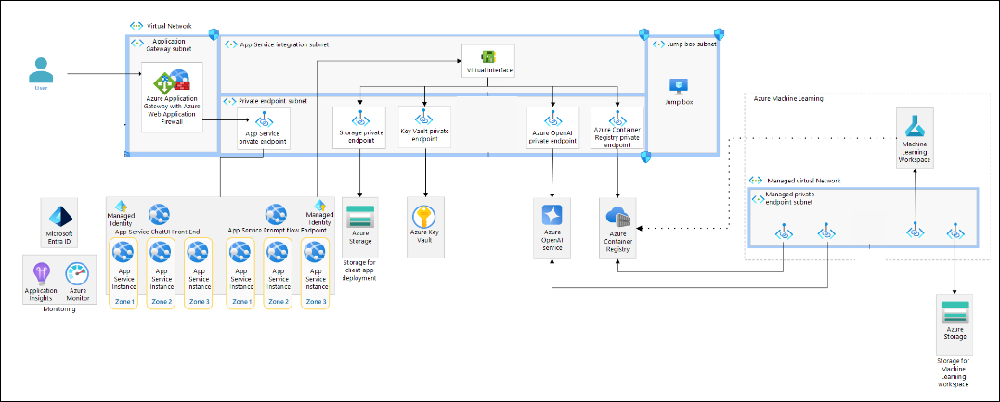
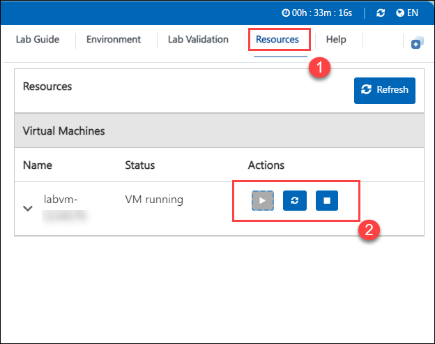

# OpenAI End-to-End Baseline

### Overall Estimated Duration: 5 Hours

### Overview

This hands-on lab series provides a comprehensive workflow for utilizing Azure OpenAI Service and Azure App Service. Participants will first create, test, and deploy a prompt flow, ensuring its functionality through runtime testing. The lab then guides users in cloning and enhancing the prompt flow before deploying it to an Azure Machine Learning-managed online endpoint. Following this, participants will publish a chat front-end web application and deploy the flow to Azure App Service. Finally, they will build and push a container image for the chat flow and host it on Azure App Service to enable scalable, web-based interactions.

## Objective 
The objective of these labs is to guide participants through creating, deploying, and managing prompt flows and chat applications using Azure OpenAI Service and Azure App Service.

1. **Managing and Enhancing Prompt Flows**: This hands-on exercise aims to guide participants through the creation, testing, and optimization of prompt flows to ensure efficient and effective deployment.

2. **Deploying to Azure Machine Learning Endpoints and Publishing Web Applications**: This hands-on exercise aims on how to deploy prompt flows to Azure Machine Learning endpoints and publish associated web applications.

3. **Deploying and Managing Chat Flow Containers on Azure App Service**: This hands-on exercise aims to teach participants how to deploy, build, and manage chat flow container images on Azure App Service for scalable web hosting.

## Prerequisites

 1. Familiarity with coding and containerization concepts, especially related to building and managing Docker images.
 2. Knowledge of tools like Azure CLI or Azure Portal for deploying and managing resources, along with a development environment for coding and testing, is required.

## Architecture

The labs utilize the Azure OpenAI Service API for creating and testing prompt flows, Azure Machine Learning for deploying and managing online endpoints, and Azure App Service for hosting the chat flow web app and container image. Resources include Azure CLI or Azure Portal for deployment and management and containerization tools for building and pushing images.

   
 
## Accessing Your Lab Environment
 
1. Once you are ready to dive in, your virtual machine and lab guide will be right at your fingertips within your web browser.
 
   

 ### Virtual Machine & Lab Guide
 
   Your virtual machine is your workhorse throughout the workshop. The lab guide is your roadmap to success.
 
## Exploring Your Lab Resources
 
1. To get a better understanding of your lab resources and credentials, navigate to the **Environment Details** tab.
 
   
 
## Utilizing the Split Window Feature
 
 1. For convenience, you can open the lab guide in a separate window by selecting the **Split Window** button from the top right corner. 
    
    
 
## Managing Your Virtual Machine
 
 1. Feel free to **start, stop, or restart (2)** your virtual machine as needed from the **Resources (1)** tab.  
 
    

## **Lab Duration Extension**

1. To extend the duration of the lab, kindly click the **Hourglass** icon in the top right corner of the lab environment. 

   

>**Note:** You will get the **Hourglass** icon when 10 minutes are remaining in the lab.

2. Click **OK** to extend your lab duration.
 
   

3. If you have not extended the duration prior to when the lab is about to end, a pop-up will appear, giving you the option to extend. Click **OK** to proceed. 

## Let's Get Started with Azure Portal
 
1. On your virtual machine, click on the Azure Portal icon as shown below: 

 
   .png)
 
2. You will see the **Sign in to continue to Microsoft Azure** tab. Here, enter your credentials: 

 
   - **Email/Username:** <inject key="AzureAdUserEmail"></inject>
 
       
 
3. Next, provide your password: 
 
   - **Password:** <inject key="AzureAdUserPassword"></inject>
 
      
 
4. If prompted to stay signed in, you can click **No**.
 
5. If a **Welcome to Microsoft Azure** pop-up window appears, simply click **Maybe Later** to skip the tour.
 
6. Click **Next** from the bottom right corner to embark on your lab journey! 
 
   .png)
 
 Now, you are all set to explore the powerful world of technology. Feel free to reach out if you have any questions along the way. Enjoy your workshop!
