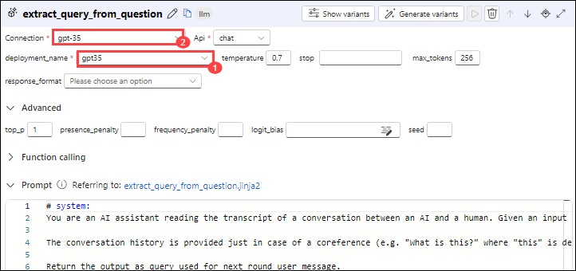

# Lab 01: Open AI end to end baseline

## Lab scenario
In this lab, you will engage in a series of steps aimed at creating, testing, and deploying a prompt flow using Azure Machine Learning Studio. This process begins with establishing a connection to Azure OpenAI, followed by the cloning of an existing prompt flow. Subsequently, you will configure this cloned flow to meet specific requirements or objectives. Finally, the flow will undergo testing to ensure its functionality and effectiveness before being deployed for practical use.

## Lab objectives
In this lab, you will perform the following:
- Task 1: Create, test, and deploy a Prompt flow
- Task 2: Clone an existing prompt flow
- Task 3: Add runtime & Test the flow

## Estimated timing:

### Task 1: Create, test, and deploy a Prompt flow

1.  In the **Azure portal**, in **Search resources, services, and docs** search for and select **mlw-<inject key="DeploymentID" enableCopy="false"></inject>** for Machine learning workspace and select **Launch studio**.

     

1.  On the **Azure AI | Machine Learning Studio**, under **mlw-<inject key="DeploymentID" enableCopy="false"></inject>** workspace, from the left navigation pane select **Prompt flow**.

    

1.  Click on the **Connections** tab and click **Create (1)** , Choose **Azure OpenAI (2)** from the dropdown.

    

1. Navigate back to the Azure Portal, in **Search resources, services, and docs** search for and select **oai-<inject key="DeploymentID" enableCopy="false"></inject>**. 

1. On the **oai-<inject key="DeploymentID" enableCopy="false"></inject>**, from the left navigation pane under **Resource Management** select **Keys and Endpoints**.

1. Copy the value of **KEY 1** and **Endpoint**, paste these values in the notepad you will use these values in the next step.

1. Navigate back to the **Connections** tab, and follow these instructions to fill out the properties for creating connections:
    
   - Name: **gpt35**
   - Provider: **Azure OpenAI**
   - Subscription Id: Select the default
   - Azure OpenAI Account Names: **oai-<inject key="DeploymentID" enableCopy="false"></inject>**
   - API Key: Paste the KEY 1 value here that you copied in previous step
   - API Base: Paste the Endpoint value here that you copied in previous step
   - API type: **azure**
   - API version: Keep it as default
   - Select **Save**

### Task 2: Clone an existing prompt flow
   
1.  Now select the **Flows (1)** tab and click **+ Create (2)**.

    
 
1.  On the **Create a new flow** page, under **Explore gallery**, in **Chat with Wikipedia (1)** box select **Clone (2)**.

    
   
1. On the **Clone flow**, name the folder name as **chat_wiki** and press **Clone**
   
1. Set the **Connection** and **deployment_name** to **gpt35** and set the **max_tokens** property of the deployment_name to **256**, for the following steps:
   - extract_query_from_question
   - augmented_chat
  
    

    
   
6. Click on **Save (1)** and click on **Start compute session (2)**.

   

     >**Note**: Wait for the compute session to complete , it takes 1-3 minutes.

### Task 3: Add runtime & Test the flow

1. Select **Run** to execute all the nodes after the current node has completed its run.

   
   
     >**Note**: Use the scrollbar or down arrow button to navigate down the page, ensuring the graph flow remains unchanged.

4. After executing all the nodes, select **Chat (1)** button.

   
   
6. Enter a question : `What is the difference between this model and previous neural network?` , Wait for the output to be generated, then check the answer and the number of tokens used.

   

> **Congratulations** on completing the task! Now, it's time to validate it. Here are the steps:
> - If you receive a success message, you can proceed to the next task.
> - If not, carefully read the error message and retry the step, following the instructions in the lab guide. 
> - If you need any assistance, please contact us at labs-support@spektrasystems.com. We are available 24/7 to help you out.
<validation step="a191a267-12d7-4c02-a757-1bff8a5daa07" />

## Review
In this lab you have completed the following tasks:
- Created, tested, and deployed a Prompt flow
- Cloned an existing prompt flow
- Added runtime & Test the flow

