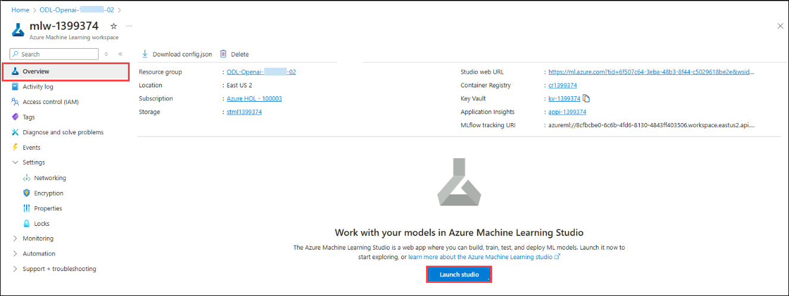

# Lab 01: Open AI end to end baseline

## Lab scenario
In this lab, you will engage in a series of steps aimed at creating, testing, and deploying a prompt flow using Azure Machine Learning Studio. This process begins with establishing a connection to Azure OpenAI, followed by the cloning of an existing prompt flow. Subsequently, you will configure this cloned flow to meet specific requirements or objectives. Finally, the flow will undergo testing to ensure its functionality and effectiveness before being deployed for practical use.

## Lab objectives
In this lab, you will perform the following:
- Task 1: Create, test, and deploy a Prompt flow
- Task 2: Clone an existing prompt flow
- Task 3: Add runtime & Test the flow

## Estimated timing:

### Task 1: Create, test, and deploy a Prompt flow

1. In the **Azure portal**, search for **mlw-<inject key="DeploymentID" enableCopy="false"></inject>** for Machine learning workspace and select **Launch studio**.

   

2. Click on the **workspace** **mlw-<inject key="DeploymentID" enableCopy="false"></inject>**
   
   
   
3. Click on **Prompt flow** in the left navigation in Machine Learning Studio.

    

4. Click on the **Connections** tab and click **Create** , Choose **Azure OpenAI** from the dropdown.

   

6. Fill out the properties:
    - Name: '**gpt35**' Make sure you use this name.
    - Provider: Azure OpenAI
    - Subscription Id: choose from the DropDown
    - Azure OpenAI Account Names: **oai-<inject key="DeploymentID" enableCopy="false"></inject>**
    - API Key: <Choose a key from 'Keys and endpoint' in your Azure OpenAI instance in the Portal>
    - API Base: <Choose the endpoint from 'Keys and endpoint' in your Azure OpenAI instance in the Portal>
    - API type: azure
    - API version:

    
   
   >**Note**: Open the openai resource from the portal and copy the key and end point from resource management section.

### Task 2: Clone an existing prompt flow

1. Click on **Prompt flow** in the left navigation in **Machine Learning Studio**.

   
   
2. Click on the **Flows tab** and click **Create**.

   
 
3. Click **Clone** under **Chat with Wikipedia**.

   
   
4. Name it **chat_wiki** and Press **Clone**

   
   
5. Set the **Connection** and **deployment_name** to **gpt35** and set the **max_tokens property** of the deployment_name to 256, for the following 
    steps:
    - extract_query_from_question
    - augmented_chat
  
   

   
   
6. Click on **Save**.

### Task 3: Add runtime & Test the flow

1. Click on **Start run-time session**.

   

   >**Note**: Wait for the compute session to complete , it takes 1-3 minutes.

2. Execute all the nodes once the current node has completed its run.

   
   
   >**Note**: Use the scrollbar or down arrow button to navigate down the page, ensuring the graph flow remains unchanged.

4. Click on **Chat** on the UI

   
   
6. Enter a question : `What is the difference between this model and previous neural network?` , Wait for the output to be generated, then check the answer and the number of tokens used.

## Review
In this lab you have completed the following tasks:
- Created, tested, and deployed a Prompt flow
- Cloned an existing prompt flow
- Added runtime & Test the flow

