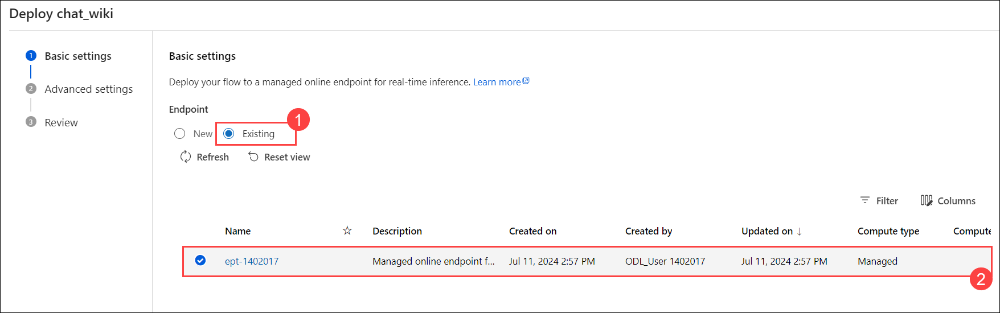
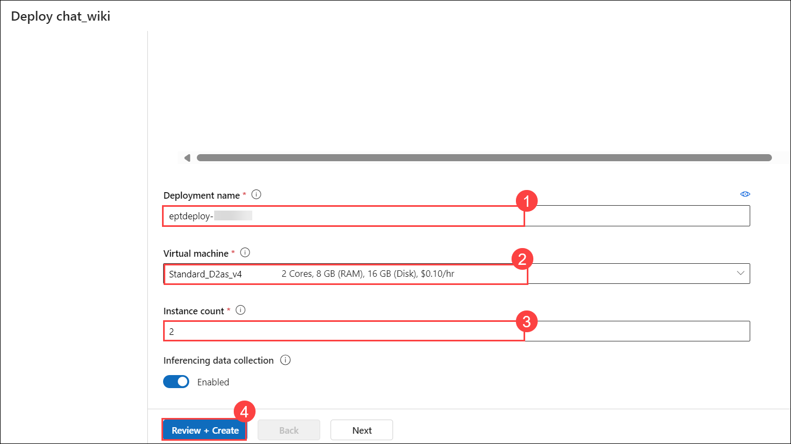

# Lab 02: OpenAI end to end baseline

## Lab scenario
In this lab, you will walk through the process of deploying a machine learning model to an Azure Machine Learning managed online endpoint and publishing a front-end web application to interact with the deployed model. This hands-on experience covers key aspects of the deployment pipeline, including creating and configuring resources on Azure, uploading necessary files, and setting up environment variables.

## Lab objectives
In this lab, you will perform the following:
- Task 1: Deploy to Azure Machine Learning managed online endpoint
- Task 2: Publish the Chat front-end web app

## Estimated timing:

### Task 1: Deploy to Azure Machine Learning managed online endpoint

1. In the **chat_wiki** flow, create a deployment, by selecting the **deploy** icon from the tool bar.

    

5. On the **Deploy chat_wiki** page, choose **Existing (1)** endpoint and select **ept-<inject key="DeploymentID" enableCopy="false"></inject> (2)** endpoint.

    
   
7. Follow the instructions to create a deployment:
    
    - Deployment name: **eptdeploy-<inject key="DeploymentID" enableCopy="false"></inject> (1)**.
   
   - Virtual machine: **Standard_D2as_v4 (2)**
   
   - Instance count: **2 (3)**
   
   - Select **Review + Create (4)**

        
    
    - Select **Create**

        >**Note:** You might need to scroll down to view the options above.

        >**Note:** If the pop-up states that **Prompt flow deployment "eptdeploy-<inject key="DeploymentID" enableCopy="false"></inject>" of endpoint "ept-1402017" failed**, select **Endpoints** from the left navigation pane, and check whether the endpoint with the name **eptdeploy-<inject key="DeploymentID" enableCopy="false"></inject>** was created. If it is there, please ignore the message.
    
### Task 2: Publish the Chat front-end web app

1. In the Azure Portal, go to the storage account **st <inject key="DeploymentID" enableCopy="false"></inject>**, from the left navigation menu, select **Containers** section within **data storage**, and select **deploy** container. From there, upload the file `chatui.zip` located at `C:\LabFiles\openai-end-to-end-baseline\website\chatui.zip`.

   
   
1. Select **chatui.zip**, select **Generate SAS** tab, and click on **Generate SAS token and URL**. Copy the Blob SAS URL, and paste it in the notepad.

    

1. In **Search resources, services and docs** search and select for **app-<inject key="DeploymentID" enableCopy="false"></inject>**. From the left navigation menu, under **Settings** select **Environment variables**.
   
4. On the **app-<inject key="DeploymentID" enableCopy="false"></inject> | Environment variables**, select WEBSITE_RUN_FROM_PACKAGE and set the environment variable with the **SAS URL (1)** of the zip file that you copied in previous step, and select **Apply (2)**.

   
  
1. Navigate to the overview of **app-<inject key="DeploymentID" enableCopy="false"></inject>** and browse to the site listed under **Default domain** (e.g., https://www.app-1399374.azurewebsites.net.com). The site will look similar to the image attached below.

   
   
## Review
In this lab you have completed the following tasks:
- Deployed to Azure Machine Learning managed online endpoint
- Published the Chat front-end web app
