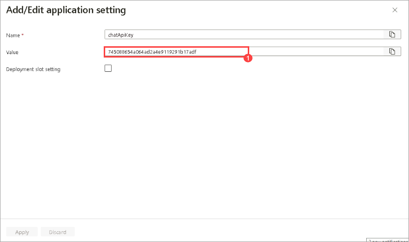
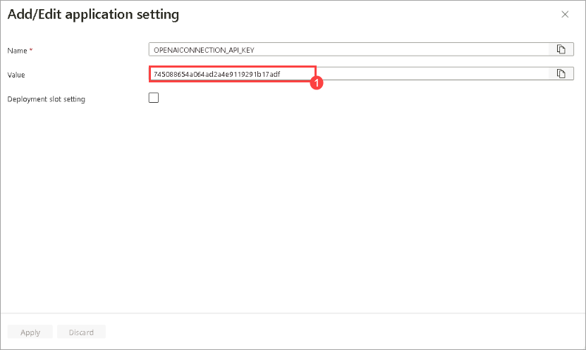
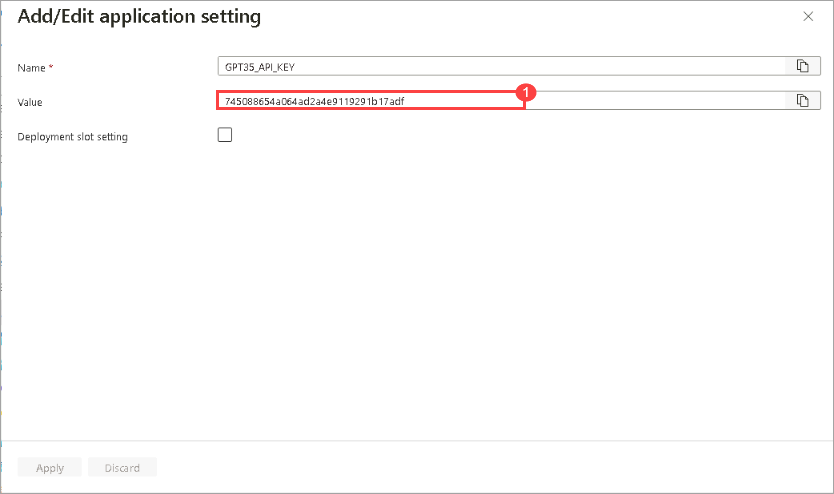
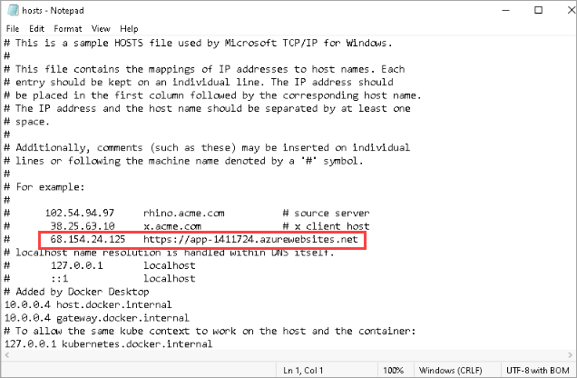
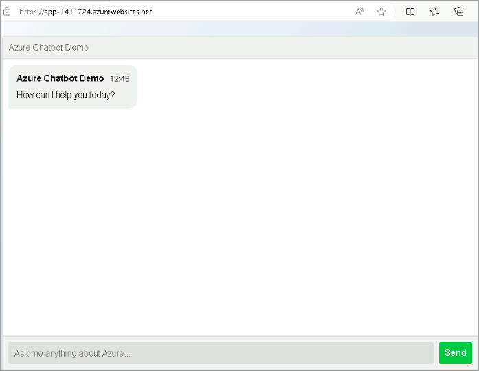

# Lab 02: Deploying to Azure Machine Learning Endpoints and Publishing Web Applications

## Lab Scenario

In this lab, you will walk through the process of deploying a machine learning model to an Azure Machine Learning managed online endpoint and publishing a front-end web application to interact with the deployed model. This hands-on experience covers key aspects of the deployment pipeline, including creating and configuring resources on Azure, uploading necessary files, and setting up environment variables.

## Lab Objectives

In this lab, you will perform the following tasks:

- **Task 1:** Deploy to Azure Machine Learning-managed online endpoint
- **Task 2:** Publish the Chat front-end web app

## Estimated Timing: 80 Minutes

### Task 1: Deploy to Azure Machine Learning-Managed Online Endpoint

1. In the **chat_wiki** flow, create a deployment by selecting the **deploy** icon from the toolbar.

    

1. On the **Deploy chat_wiki** page, choose **New (1)**, and follow the instructions to create a **deployment**:

   - Endpoint name: **mlw-<inject key="DeploymentID" enableCopy="false"></inject>-ep (2)**
     
   - Deployment name: **mlw-<inject key="DeploymentID" enableCopy="false"></inject>-ep-1 (3)**.
   
   - Virtual machine: **Select the virtual machine which is less expensive. For example: D2as_v4, D2a_v4 (4)**
   
   - Instance count: **1 (5)**
   
   - Select **Review + Create (6)**

        
    
    - Select **Create**
    
    
### Task 2: Publish the Chat Front-End Web App

1. In the Azure Portal, go to the storage account **st <inject key="DeploymentID" enableCopy="false"></inject>**, from the left navigation menu, select **Containers** section within **data storage**, and select **deploy** container. From there, upload the file `chatui.zip` located at `C:\LabFiles\openai-end-to-end-baseline\website\chatui.zip`.

   
   
1. In the **chatui.zip** page, select the **Generate SAS** tab, and click on **Generate SAS token and URL**. Copy the **Blob SAS URL** and paste it in the Notepad.

    

1. In the **Search resources, services, and docs** space, search for and select **app-<inject key="DeploymentID" enableCopy="false"></inject>**. From the left navigation menu, under **Settings**, select **Environment variables**.
   
1. On the **app-<inject key="DeploymentID" enableCopy="false"></inject> | Environment variables**, select **WEBSITE_RUN_FROM_PACKAGE** as the **Name** and set the environment variable with the **SAS URL (1)** of the zip file that you copied in the previous step. Moving on, select **Apply (2)**.

   

1. Choose `chatApiKey` for **Name** and set the **environment variable** with the **OpenAI Key (1)** that you copied in the Notepad.

   
   
1. In the **Search resources, services, and docs** space, search for and select **app-<inject key="DeploymentID" enableCopy="false"></inject>-pf**. From the left navigation menu, under **Settings** select **Environment variables**.

1. On the **app-<inject key="DeploymentID" enableCopy="false"></inject>-pf | Environment variables**, select `OPENAICONNECTION_API_KEY` for **Name** and set the **environment variable** with the **OpenAI key (1)** that you copied in Notepad.

   
   
1. On the **app-<inject key="DeploymentID" enableCopy="false"></inject>-pf | Environment variables**, click **"Add"** to create a new environment variable named `GPT35_API_KEY`, and set its value to the OpenAI key you copied in Notepad.

   

1. Click on **Apply** and save the changes.
   
## Task 3: Validate the Web App

1. Get the **public IP address** of the **Application Gateway**.
    ```
    $RESOURCE_GROUP="ODL-Openai-<inject key="DeploymentID" enableCopy="false"></inject>-02"
    # query the Azure Application Gateway Public Ip
    $APPGW_PUBLIC_IP=az network public-ip show --resource-group $RESOURCE_GROUP --name "pip-<inject key="DeploymentID"enableCopy="false</inject> " --query [ipAddress] --output tsv
    echo APPGW_PUBLIC_IP: $APPGW_PUBLIC_IP
    
    ```
1. Inside the Lab-VM, open **C:\Windows\System32\drivers\etc**, right-click on the **hosts** text file, and open it with Notepad. Under the example line, add the public IP address of the **app-<inject key="DeploymentID" enableCopy="false"></inject>**, and the default domain, as shown in the attached image. After adding it, select **Save**.

   
  
1. Navigate to the overview of the **app-<inject key="DeploymentID" enableCopy="false"></inject>** and browse through the site listed under **Default domain**<br>
   (e.g., https://app-1399374.azurewebsites.net). The site will look similar to the image attached below.

   

> **Congratulations** on completing the task! Now, it is time to validate it. Here are the steps:
> - If you receive a success message, you can proceed to the next task.
> - If not, carefully read the error message and retry the step, following the instructions in the lab guide. 
> - If you need any assistance, please contact us at **labs-support@spektrasystems.com**. We are available 24/7 to help you out.
<validation step="bc1076dc-0395-45bd-ab87-150b43d617e5" />
   
## Review

In this lab, you have completed the following tasks:

- Deployed to an Azure Machine Learning managed online endpoint.
- Published the chat front-end web app.
