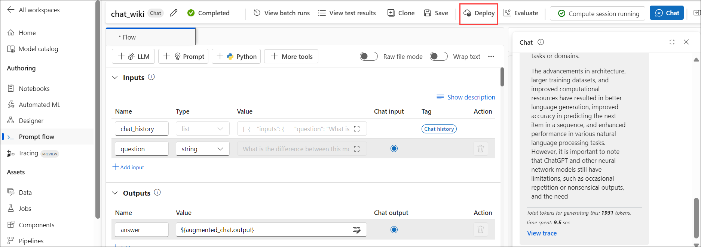
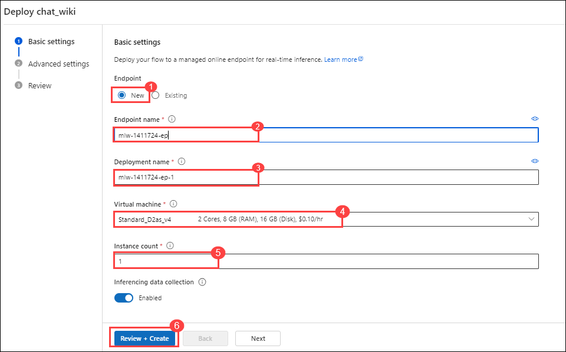
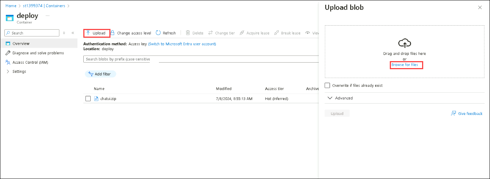
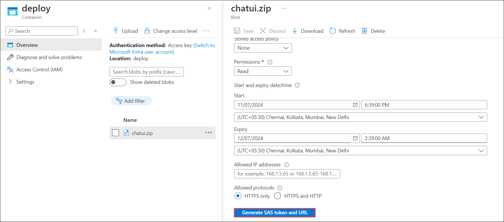
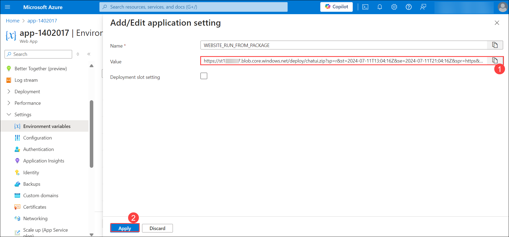
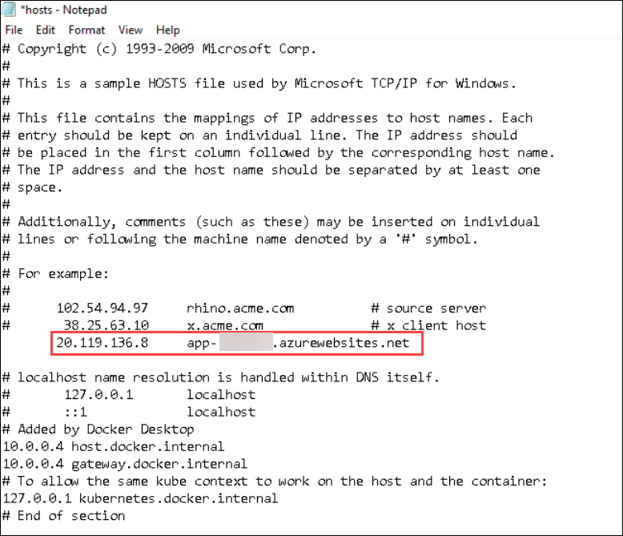
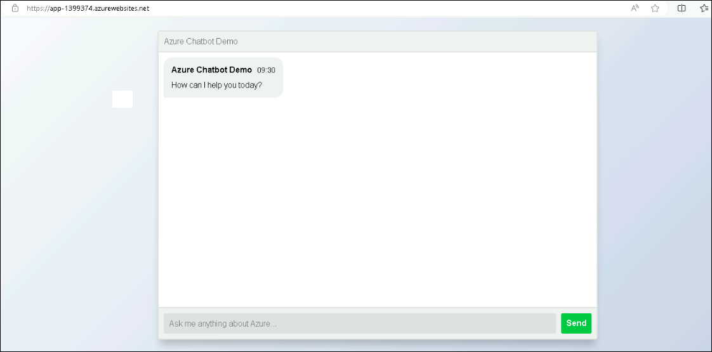

# Lab 02: OpenAI end to end baseline

## Lab scenario
In this lab, you will walk through the process of deploying a machine learning model to an Azure Machine Learning managed online endpoint and publishing a front-end web application to interact with the deployed model. This hands-on experience covers key aspects of the deployment pipeline, including creating and configuring resources on Azure, uploading necessary files, and setting up environment variables.

## Lab objectives
In this lab, you will perform the following:
- Task 1: Deploy to Azure Machine Learning managed online endpoint
- Task 2: Publish the Chat front-end web app

## Estimated timing:

### Task 1: Deploy to Azure Machine Learning managed online endpoint

1. In the **chat_wiki** flow, create a deployment, by selecting the **deploy** icon from the tool bar.

    

1. On the **Deploy chat_wiki** page, choose **New (1)**, follow the instructions to create a deployment:

   - Endpoint name: **mlw-<inject key="DeploymentID" enableCopy="false"></inject>-ep (2)**
     
   - Deployment name: **mlw-<inject key="DeploymentID" enableCopy="false"></inject>-ep-1 (3)**.
   
   - Virtual machine: **Select the virtual machine which is in less cost, for example: D2as_v4, D2a_v4 (4)**
   
   - Instance count: **1 (5)**
   
   - Select **Review + Create (6)**

        
    
    - Select **Create**
    
    
### Task 2: Publish the Chat front-end web app

1. In the Azure Portal, go to the storage account **st <inject key="DeploymentID" enableCopy="false"></inject>**, from the left navigation menu, select **Containers** section within **data storage**, and select **deploy** container. From there, upload the file `chatui.zip` located at `C:\LabFiles\openai-end-to-end-baseline\website\chatui.zip`.

   
   
1. Select **chatui.zip**, select **Generate SAS** tab, and click on **Generate SAS token and URL**. Copy the Blob SAS URL, and paste it in the notepad.

    

1. In **Search resources, services and docs** search and select for **app-<inject key="DeploymentID" enableCopy="false"></inject>**. From the left navigation menu, under **Settings** select **Environment variables**.
   
1. On the **app-<inject key="DeploymentID" enableCopy="false"></inject> | Environment variables**, select WEBSITE_RUN_FROM_PACKAGE and set the environment variable with the **SAS URL (1)** of the zip file that you copied in previous step, and select **Apply (2)**.

   

## Task 3 : Validate the web app.

1. Get the public IP address of the Application Gateway.
    ```
    $RESOURCE_GROUP="ODL-Openai-<inject key="DeploymentID" enableCopy="false"></inject>-02"
    # query the Azure Application Gateway Public Ip
    $APPGW_PUBLIC_IP=az network public-ip show --resource-group $RESOURCE_GROUP --name "pip-<inject key="DeploymentID"enableCopy="false</inject> " --query [ipAddress] --output tsv
    echo APPGW_PUBLIC_IP: $APPGW_PUBLIC_IP
    
    ```
1. Inside the Lab-VM, open **C:\Windows\System32\drivers\etc**, right-click on the **hosts** text file, and open it with Notepad. Under the example line, add the Public IP address of the **app-<inject key="DeploymentID" enableCopy="false"></inject>**, and the default domain. as shown in the attached image. After adding it select **Save**.

   
  
1. Navigate to the overview of **app-<inject key="DeploymentID" enableCopy="false"></inject>** and browse to the site listed under **Default domain**<br>
   (e.g., https://www.app-1399374.azurewebsites.net.com). The site will look similar to the image attached below.

   

> **Congratulations** on completing the task! Now, it's time to validate it. Here are the steps:
> - If you receive a success message, you can proceed to the next task.
> - If not, carefully read the error message and retry the step, following the instructions in the lab guide. 
> - If you need any assistance, please contact us at labs-support@spektrasystems.com. We are available 24/7 to help you out.
<validation step="bc1076dc-0395-45bd-ab87-150b43d617e5" />
   
## Review
In this lab you have completed the following tasks:
- Deployed to Azure Machine Learning managed online endpoint
- Published the Chat front-end web app
