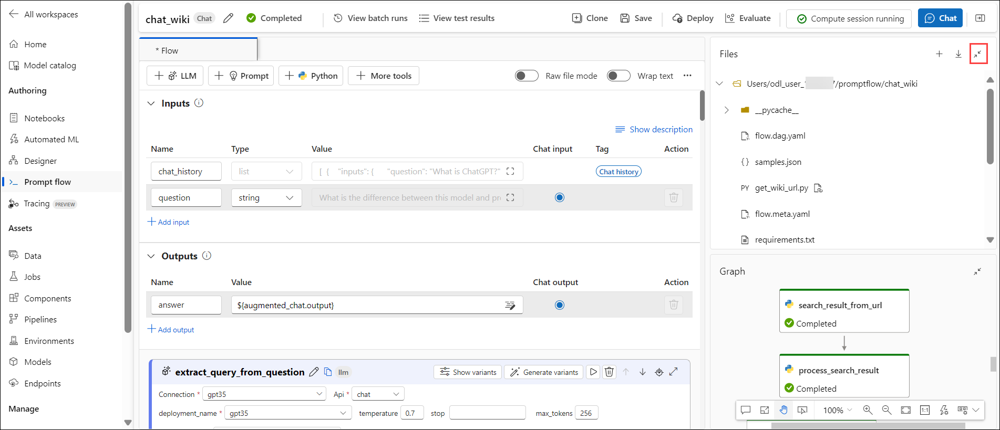
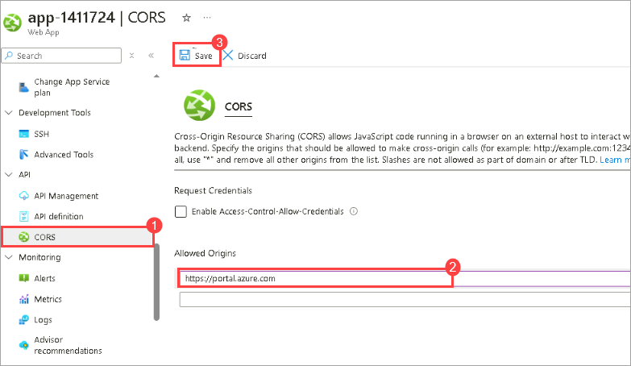
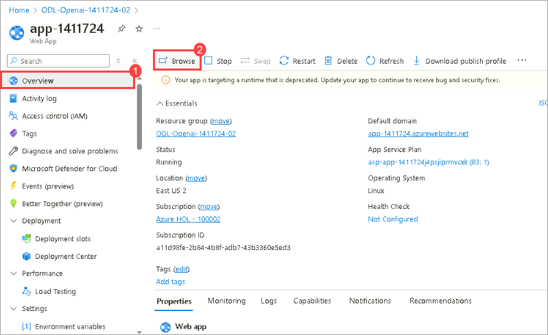
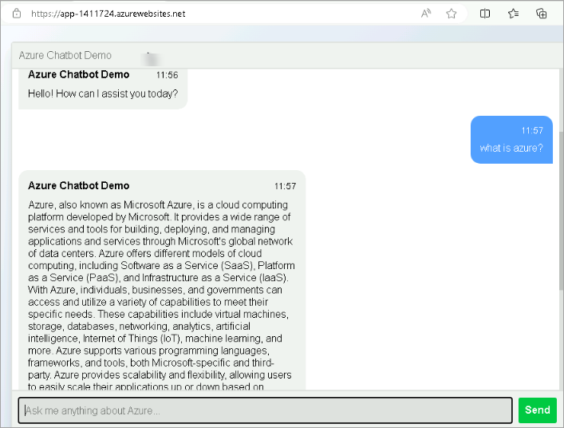

# Lab 03: Openai end to end baseline

## Lab scenario
In this lab, you'll deploy an Azure OpenAI prompt flow to Azure App Service. Start by downloading the prompt flow as a zip from Azure ML Studio. Set up a Python environment using Conda, configure connections in YAML files, and build the flow into a Docker container with `pf flow build`. Push the image to your Azure Container Registry and deploy it to App Service. Update the chat UI's configuration to use the deployed prompt flow endpoint (`https://$PF_APP_SERVICE_NAME.azurewebsites.net/score`) and verify client application functionality.

## Lab objectives
In this lab, you will perform the following:
- Task 1: Deploy the flow to Azure App Service option
- Task 2: Build and push the image
- Task 3: Host the chat flow container image in Azure App Service

## Estimated timing:

### Task 1: Deploy the flow to Azure App Service option

1. Navigate back to the **chat_wiki** tab, in Azure Machine Learning Studio.

1. Expand the **Files** tab in the right pane of the UI.

    

1. Click on the **download icon** to download the flow as a zip file. Unzip the prompt flow zip file you downloaded.

    

1. Minimize **Azure Portal**, from the desktop, double-click on the **Visual Studio Code**. Select **Explorer**, select **Open Folder** and select the folder that you downloaded.

    >**Note:** On the **Do you trust the authors of the files in this folder** pop-up select **Yes, I trust the authors**.

1. From the top menu bar, select **View**, and then select **Terminal**. Perfom the below commands in the terminal:

   ```
    conda create --name pf python=3.11.4
    ```

    >**Note:** If you are facing any errors with conda commands, follow these steps, otherwise you can move on to the next steps:

    - From the search bar on the desktop, search for **Environment variables** and select **Edit the system environment variables**.
  
    - In the **System Properties** window, select **Environment variables**.

    - Under **System variables**, select **Path** and click **Edit**.
    
    - Click **New** and add this path: **C:\LabFiles\Anaconda3\Scripts**.
    
    - Click **OK** three times to close all windows.
  
    - Re-open **Visual studio code**, and perform these commands, to active the conda.

    ```
    conda init
    ```

    ```
    conda activate 
    ```

    ```
    conda activate pf
    ```

    ```
    pip install promptflow promptflow-tools
    ```
    
    >**Note:** You will need to install the following if you build the docker image locally
    ```
    pip install keyrings.alt
    ```
    ```
    pip install bs4
    ```
    ```
    pip install openai
    ```

1. Create a folder called **connections**, under **chat_wiki** folder:

    ```
    mkdir connections
    ```

1. Under the **Connections** folder create a file called **gpt35.yaml**.

10. Enter the following values in the file:

     - API Key: Paste the KEY 1 value here that you copied .
     - API Base: Paste the Endpoint value here that you copied .

    ```
    $schema: https://azuremlschemas.azureedge.net/promptflow/latest/AzureOpenAIConnection.schema.json
    name: gpt35
    type: azure_open_ai
    api_key: "${env:OPENAICONNECTION_API_KEY}"
    api_base: "${env:OPENAICONNECTION_API_BASE}"
    api_type: "azure"
    api_version: "2023-07-01-preview"
    ```

    >**Note**:The App Service is configured with App Settings that surface as environment variables for OPENAICONNECTION_API_KEY and OPENAICONNECTION_API_BASE.

12. Now, build the flow by running these commands:
    
    ```
    pf connection create -f .\connections\gpt35.yaml
    ```

    ```
    pf flow build --source ./ --output dist --format docker
    ```

    >**Note:** The following code will create a folder named 'dist' with a docker file and all the required flow files.

### Task 2: Build and push the image

1. Ensure the **requirements.txt** in the **dist/flow** folder has the appropriate requirements. At the time of writing, they were as follows:

    ```
    azure-ai-ml==1.15.0
    promptflow-azure>=1.12.0
    azure-ai-resources>=1.0.0b8
    azure-ai-generative[promptflow]>=1.0.0b8
    promptflow-azure>=1.12.0
    promptflow>=1.12.0
    promptflow-tools>=1.4.0
    promptflow-evals>=0.3.0
    azure-identity==1.16.0
    python-dotenv>=1.0.0
    azureml-mlflow>=1.53.0
    keyrings.alt
    python-dotenv
    bs4
    openai
    ```
1. Ensure the connections folder with the connection was created in the dist folder. If not, copy the connections folder, along with the connection file to the dist folder.

1. In the visual studio code open the **Git Bash** terminal, build and push the container image by running these following commands from the dist folder in your terminal:

    ```
    cd dist
    ```
    
    ```
    az login
    ```
    ```
    $NAME_OF_ACR="cr<inject key="DeploymentID" enableCopy="false"></inject>"
    $ACR_CONTAINER_NAME="aoai"
    $IMAGE_NAME="wikichatflow"
    $IMAGE_TAG="1.1"
    $FULL_IMAGE_NAME=$ACR_CONTAINER_NAME+"/"+$IMAGE_NAME+":"+$IMAGE_TAG
    az acr build -t $FULL_IMAGE_NAME -r $NAME_OF_ACR .
    ```
    

    >**Note:** If the error shows that **Run Failed**, navigate to the **Azure Portal**, in the search bar search and select **cr<inject key="DeploymentID" enableCopy="false"></inject>**, from the left navigation pane, select **Networking**, select **All networks** in **Public network access**, and select **Save**. Navigate to the visual studio code, and re-run the previous command.

### Task 3 : Host the chat flow container image in Azure App Service

1. Perform the following steps to deploy the container image to Azure App Service:

2. Set the container image on the pf App Service

    ```
    $PF_APP_SERVICE_NAME="app-<inject key="DeploymentID" enableCopy="false"></inject>-pf"
    $RESOURCE_GROUP="ODL-Openai-<inject key="DeploymentID" enableCopy="false"></inject>-02"
    $ACR_IMAGE_NAME="$NAME_OF_ACR.azurecr.io/$ACR_CONTAINER_NAME/$IMAGE_NAME:$IMAGE_TAG"
    
    az webapp config container set --name $PF_APP_SERVICE_NAME --resource-group $RESOURCE_GROUP --docker-custom-image-name $ACR_IMAGE_NAME --docker-registry-server-url https://$NAME_OF_ACR.azurecr.io
    az webapp deployment container config --enable-cd true --name $PF_APP_SERVICE_NAME --resource-group $RESOURCE_GROUP
    ```
    
3. Modify the configuration setting in the App Service that has the chat UI and point it to your deployed promptflow endpoint hosted in App Service instead of the managed online endpoint.


   ```
    $RESOURCE_GROUP="ODL-Openai-<inject key="DeploymentID" enableCopy="false"></inject>-02"
    $UI_APP_SERVICE_NAME="app-<inject key="DeploymentID" enableCopy="false"></inject>"
    $ENDPOINT_URL="https://$PF_APP_SERVICE_NAME.azurewebsites.net/score"
    
    az webapp config appsettings set --name $UI_APP_SERVICE_NAME --resource-group $RESOURCE_GROUP --settings chatApiEndpoint=$ENDPOINT_URL
    az webapp restart --name $UI_APP_SERVICE_NAME --resource-group $RESOURCE_GROUP
    ```

4. In the web **app-<inject key="DeploymentID" enableCopy="false"></inject>**, Under API  choose **CORS** , Update the link `https://portal.azure.com`

   

5. Repeat the steps for web **app-<inject key="DeploymentID" enableCopy="false"></inject>-pf**.
      
6. Validate the web **app-<inject key="DeploymentID" enableCopy="false"></inject>-pf** , Click on **Browse**.

   

7. Engage in a conversation with the bot to find the response.

   

> **Congratulations** on completing the task! Now, it's time to validate it. Here are the steps:
> - If you receive a success message, you can proceed to the next task.
> - If not, carefully read the error message and retry the step, following the instructions in the lab guide. 
> - If you need any assistance, please contact us at labs-support@spektrasystems.com. We are available 24/7 to help you out.
<validation step="98be4539-9dd7-4035-8b00-a464221c74c5" />

## Review
In this lab you have completed the following tasks:
- Deployed the flow to Azure App Service option
- Builded and push the image
- Hosted the chat flow container image in Azure App Service
